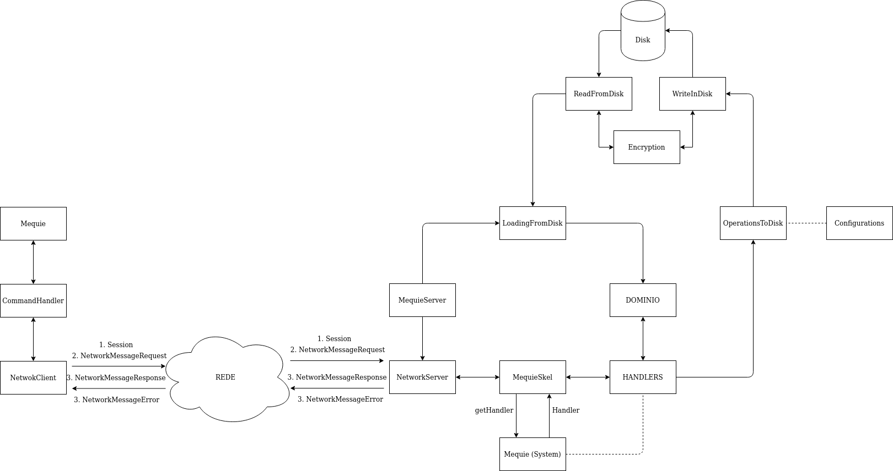

# MequieChat - A WhatsApp clone

##  Grupo 37
* 51021 - Pedro Marques
* 51110 - Marcelo Mouta
* 51468 - Bruno Freitas

## Como executar o projeto
Abra o terminal dentro da pasta 'SegC-grupo37-proj2' para executar os próximos comandos.  
Pode deslocar-se para lá fazendo:
`cd $HOME/SegC-grupo37-proj2`

### BUILD

Para compilar o projeto temos de executar o script bash build.sh

Antes de executar aconselhamos a executar primeiro:  
`chmod +x ./build.sh`

E finalmente:  
`./build.sh`

### RUN

Para correr o programa com os ficheiros de permissões corretamente é necessario e que este se encontre localizado na home do utilizador: `$HOME/SegC-grupo37-proj1-2`

#### Servidor:
`cd server/`  
`java -Djava.security.manager -Djava.security.policy=server.policy -cp bin/ mequie.main.MequieServer <port> <keystore> <keystore-password>`
#### Cliente:
`java -Djava.security.manager -Djava.security.policy=client/client.policy -cp client/bin/:server/bin/ mequie.main.Mequie <serverAddress> <truststore> <keystore> <keystore-password> <localUserID>`
    
#### Keystores:
Tanto a keystore presente no servidor (`server/Data/keystore.server`) como a do cliente (`client/keystore.client`) utilizam a mesma password: *admin123*

#### Exemplo de utilização:
##### Servidor:  
   `cd server/`  
   `java -Djava.security.manager -Djava.security.policy=server.policy -cp bin/ mequie.main.MequieServer 5001 Data/keystore.server admin123`  
##### Cliente:    
   `java -Djava.security.manager -Djava.security.policy=client/client.policy -cp client/bin/:server/bin/ mequie.main.Mequie localhost:5001 client/truststore.client client/keystore.client admin123 user01`

## Arquitetura do Software


## Gestão de dados cifrados (persistência em disco)

### Servidor

```
Data
│   users.txt - todos os utilizadores e a localização da seu certificado*
│   group.txt - todos os grupos e quem pertence ao grupo, owner em 1o*
|   keystore.server - guarda a chave privada do servidor no fomato JCEKS
│
└───groupExample - Cada grupo tem a sua pasta
    │   keyLocation.txt - com username:localização das chaves grupo*
    │   message_info.txt - MessageID:p(photo) ou t(texto):quem falta ler*
    |   text_messages.txt - MessageID:quem enviou:conteúdo text message*
    |   groupExample1 - ficheiro de bytes que representam uma foto
    |   ...
    |   groupExampleN
    |   0 - ficheiro do owner IDChaveGrupo:bytes da chave em base64
    |   1 - ficheiro de um membro do grupo que não é owner
    |   ...
    |   N
PubKeys
|   certMequieServer.cer - certificado do servidor
|   userExampleCertificate.cer - certificado para um user do sistema
```
    * Irá ter todas as photos que forem enviadas para o grupo e que nao tenham sido vistas por todos os utilizadores do grupo

Nota: (*) significa que o ficheiro está cifrado

### Cliente

```
keystore.client - guarda a chave privada do cliente no fomato JCEKS
truststore.client - trust store do cliente
ClientData
│
└───photos_groupExample - Cada grupo tem a sua pasta de fotos
    |   groupExample1 - ficheiro de bytes que representam uma foto
PubKeys
|   certMequieServer.cer - certificado do servidor
|   userExampleCertificate.cer - certificado para um user do sistema
```

### Troca de Mensagens
* Autenticação é um 4-way handshake:
    1. Cliente: Enviado Session com username para indicar ao servidor que quer autenticar-se
    2. Servidor: Servidor envia a classe Session com mais o nonce e uma flag a indicar se o user é conhecido ou não
    3. Cliente: Assina o nonce (e envia o certificado se a falg vier a true)
    4. Servidor: Servidor envia uma NetworkMessage a dizer se foi autenticado com sucesso podendo começar a comunicação
    
* Depois da autenticação:
    Troca de mensagens (NetworkMessages) com os resultados dos comandos ou erros (enviado exceptions)


## Limitações 

### Cliente:

O cliente apenas reconhece os seguintes comandos/atalhos:

    create/c
    addu/a
    removeu/r
    ginfo/g
    uinfo/u
    msg/m
    photo/p
    collect/co
    history/h
    exit
    
* Para o cliente se autenticar com sucesso, é necessário que tenha na sua truststore o certificado do servidor, assim como o seu par de chaves assimétricas RSA na sua keystore.

* Para adicionar um utilizador a um grupo, é necessário que a chave pública do mesmo (no formato `<username>.cert`) esteja presente no diretório `client/PubKeys`.

* Para enviar uma foto é preciso indicar o filepath da mesma, com este pertencendo ao `SegC-grupo37-proj1/` já que apenas é permitido ler aí pela _policy_. Apenas se aceitam ficheiros até 2GB.

* Ao fazer collect, as fotos serão colocadas num diretório `ClientData` sobre uma pasta com o nome do grupo onde se enviou essa foto, que será gerado no diretório onde o programa cliente está a ser executado.

* Com a organização que usamos, o load do sistema e as operacoes de escrita em disco sao mais eficientes mas a memória ocupada é maior por haver conteúdo repetido.

### Servidor:

* Apesar de todos os ficheiros com informação sensível estarem devidamente cifrados, os nomes dos diretórios presentes em `Data/` revelam os nomes dos grupos.

* Apesar de todos os ficheiros com informação sensível estarem devidamente cifrados, os nomes dos ficheiros de certificados revelam os nomes dos users.

* Não é possível eliminar grupos.
